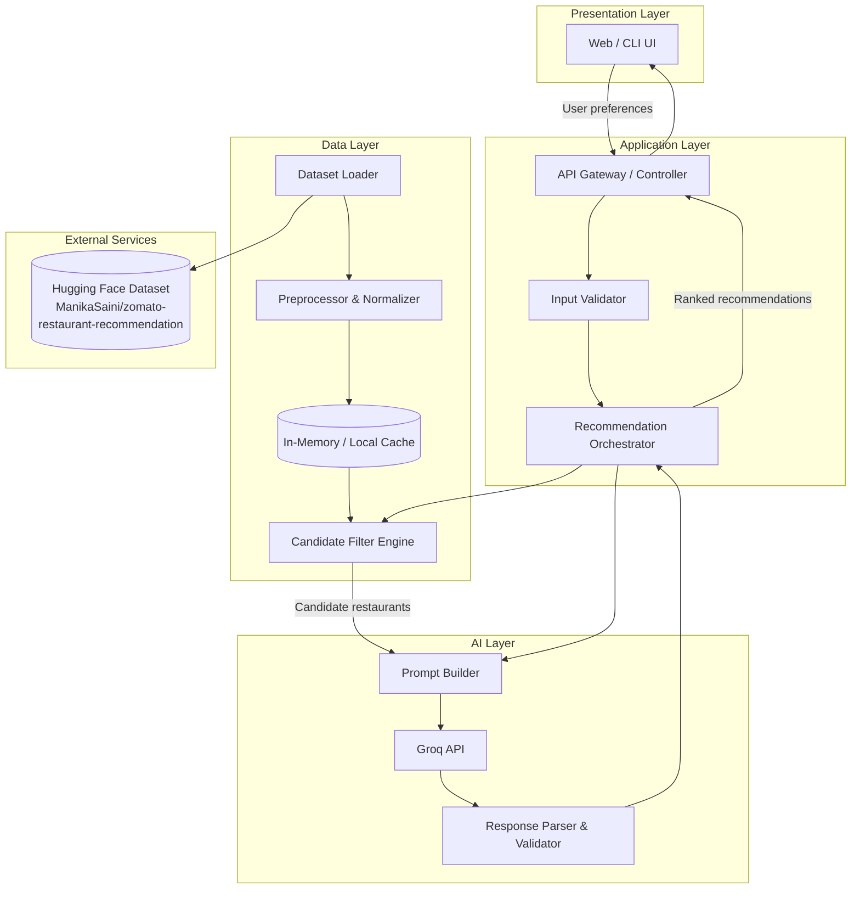
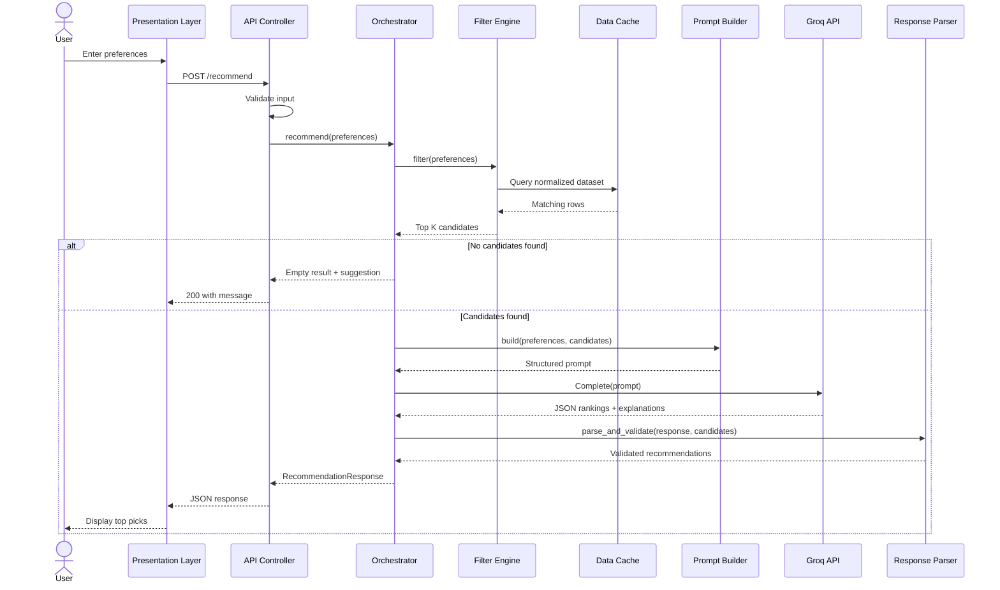
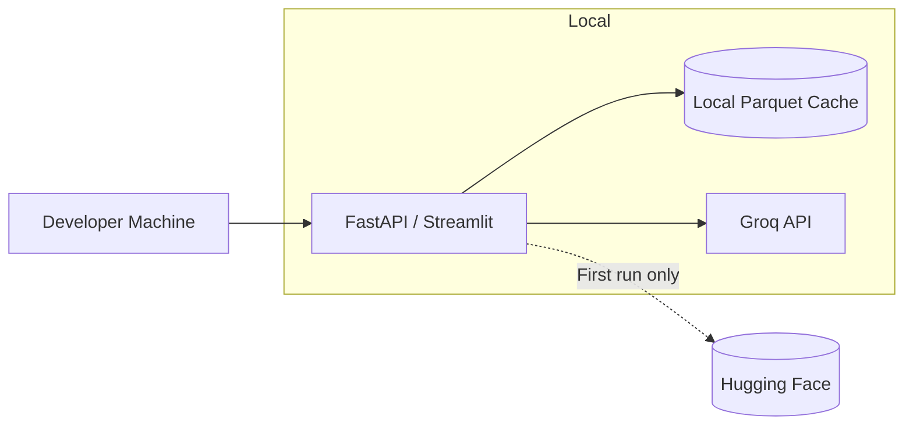
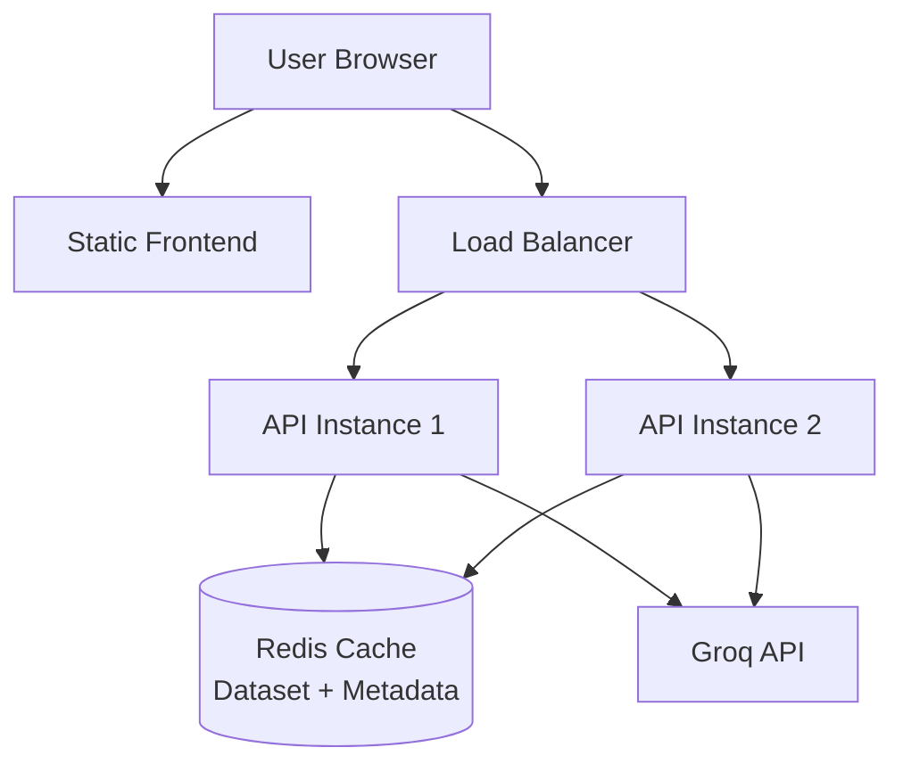

# Zomato AI Restaurant Recommendation System — Architecture

> Derived from: [`context.md`](context.md)  
> Problem source: `Docs folder/Zomato-Problem Statement.docx`

---

## 1. Overview

This document defines the system architecture for an **AI-powered restaurant recommendation service** inspired by Zomato. The application combines **structured data filtering** over a real-world restaurant dataset with **Groq** for LLM-powered ranking and explanation to deliver personalized, human-readable recommendations.

### Core Value Proposition

| Capability | Description |
|---|---|
| Structured filtering | Narrow ~51K restaurants to a relevant candidate set using hard constraints (location, budget, cuisine, rating) |
| LLM reasoning | Rank candidates and explain *why* each restaurant fits the user's preferences |
| User-friendly output | Present top picks with name, cuisine, rating, cost, and AI-generated explanation |

### End-to-End Flow

```
Ingest Data → Collect Preferences → Filter Candidates → Build LLM Prompt → Rank & Explain → Display Results
```

---

## 2. Architecture Principles

| Principle | Rationale |
|---|---|
| **Separation of retrieval and reasoning** | Deterministic filters handle scale and correctness; the LLM handles ranking and natural-language explanation |
| **Grounded recommendations** | The LLM must only recommend restaurants present in the filtered candidate set — no hallucinated venues |
| **Progressive disclosure** | Filter aggressively first, then send a bounded subset (e.g., top 20–50) to the LLM to control cost and latency |
| **Explainability by design** | Every recommendation includes a structured explanation tied to user inputs |
| **Modularity** | Data, filtering, Groq integration, and UI layers are independently replaceable (swap dataset, Groq model, or frontend without rewriting core logic) |
| **Fail gracefully** | If the LLM is unavailable, fall back to rule-based ranking (rating × votes) with template explanations |

---

## 3. High-Level System Architecture



---

## 4. Component Architecture

### 4.1 Presentation Layer

**Responsibility:** Collect user preferences and render ranked recommendations.

| Component | Role |
|---|---|
| Preference Form | Captures location, budget, cuisine, minimum rating, and free-text additional preferences |
| Results View | Displays top N restaurants with structured fields + AI explanation |
| Loading / Error States | Handles async LLM calls and API failures |

**Suggested UI fields (mapped from requirements):**

| Field | Type | Required | Example |
|---|---|---|---|
| `location` | Dropdown / autocomplete | Yes | Delhi, Bangalore |
| `budget` | Enum: `low`, `medium`, `high` | Yes | medium |
| `cuisine` | Multi-select or text | Yes | Italian, Chinese |
| `min_rating` | Number (0–5) | No | 4.0 |
| `additional_preferences` | Free text | No | family-friendly, quick service |

---

### 4.2 Application Layer

**Responsibility:** Orchestrate the recommendation pipeline and expose a clean API.

#### API Gateway / Controller

- Accepts HTTP requests (REST) or CLI arguments
- Validates and normalizes input
- Delegates to the Recommendation Orchestrator
- Returns structured JSON responses

#### Recommendation Orchestrator

Central coordinator that executes the pipeline:

1. Invoke **Candidate Filter Engine** with user preferences
2. If zero candidates → return empty result with helpful message
3. Build prompt via **Prompt Builder**
4. Call **Groq** API
5. Parse and validate Groq output via **Response Parser**
6. Merge LLM rankings with structured restaurant data
7. Return final response

---

### 4.3 Data Layer

**Responsibility:** Load, clean, cache, and query the Zomato dataset.

#### Dataset Source

| Attribute | Value |
|---|---|
| Source | [ManikaSaini/zomato-restaurant-recommendation](https://huggingface.co/datasets/ManikaSaini/zomato-restaurant-recommendation) |
| Size | ~51,717 rows, ~574 MB |
| Format | CSV (via Hugging Face `datasets` library) |
| Primary geography | Bangalore-centric (with `listed_in(city)` covering ~30 cities) |

#### Raw Dataset Schema (17 columns)

| Column | Type | Used In Filtering | Used In LLM Context | Notes |
|---|---|---|---|---|
| `name` | string | — | Yes | Restaurant name |
| `location` | string | Yes | Yes | Neighborhood / area (93 unique values) |
| `listed_in(city)` | string | Yes | Yes | City-level filter (Delhi, Bangalore, etc.) |
| `cuisines` | string | Yes | Yes | Comma-separated cuisine tags |
| `approx_cost(for two people)` | string | Yes | Yes | Needs parsing to numeric range |
| `rate` | string | Yes | Yes | Rating (e.g., `"4.1/5"`) — needs normalization |
| `votes` | int | Secondary sort | Optional | Popularity signal |
| `rest_type` | string | Optional | Yes | e.g., Casual Dining, Quick Bites |
| `online_order` | string | Optional | Yes | Yes/No — useful for "quick service" |
| `book_table` | string | Optional | Yes | Table booking availability |
| `dish_liked` | string | — | Yes | Popular dishes — enriches explanations |
| `listed_in(type)` | string | Optional | Yes | Buffet, Cafes, Pubs, etc. |
| `address` | string | — | Optional | Full address for display |
| `phone` | string | — | Optional | Contact info |
| `url` | string | — | Optional | Link to Zomato page |
| `reviews_list` | string | — | Optional | Large text — sample for LLM context only |
| `menu_item` | string | — | Optional | Menu items — optional enrichment |

#### Preprocessing Pipeline

```
Raw CSV
  → Load via Hugging Face datasets / pandas
  → Normalize rate: "4.1/5" → 4.1 (float), handle "NEW" / "-" as null
  → Parse approx_cost: "300" → 300, handle ranges "300-400" → midpoint
  → Normalize cuisines: lowercase, split on comma, trim whitespace
  → Map budget tiers to cost ranges:
       low    → ₹0–300 (for two)
       medium → ₹301–600
       high   → ₹601+
  → Drop or impute rows with critical nulls (name, city)
  → Store in normalized in-memory DataFrame or local Parquet cache
```

#### Candidate Filter Engine

Deterministic, rule-based filtering before LLM invocation:

```python
# Pseudologic
candidates = dataset[
    (dataset["listed_in(city)"].str.lower() == user.location.lower()) &
    (dataset["rate_normalized"] >= user.min_rating) &
    (dataset["approx_cost_numeric"].between(budget_min, budget_max)) &
    (dataset["cuisines_normalized"].str.contains(user.cuisine, case=False))
]

# Optional soft filters for additional_preferences (keyword match on rest_type, online_order, etc.)
# Sort by rate desc, votes desc — take top K (e.g., 30) for LLM
```

| Filter | Match Strategy |
|---|---|
| Location | Exact or fuzzy match on `listed_in(city)` or `location` |
| Budget | Numeric range on parsed `approx_cost(for two people)` |
| Cuisine | Substring / token match on `cuisines` |
| Min rating | `rate_normalized >= min_rating` |
| Additional prefs | Keyword mapping (e.g., "family-friendly" → `rest_type` contains "Family"; "quick service" → `online_order == Yes` or `rest_type` contains "Quick Bites") |

---

### 4.4 AI Layer

**Responsibility:** Rank filtered candidates and generate human-readable explanations.

#### Prompt Builder

Constructs a structured prompt containing:

1. **System instructions** — role, constraints, output format
2. **User preferences** — serialized JSON or bullet list
3. **Candidate restaurants** — compact JSON array (name, cuisine, rating, cost, rest_type, dish_liked)
4. **Output schema** — required JSON structure for parsing

#### LLM Provider — Groq

This project uses **Groq** as its LLM inference provider, leveraging custom LPU (Language Processing Unit) hardware for ultra-fast inference on open-source models.

| Attribute | Value |
|---|---|
| Provider | [Groq](https://groq.com/) |
| API | Groq REST API (OpenAI-compatible) |
| Base URL | `https://api.groq.com/openai/v1` |
| Recommended model | `llama-3.3-70b-versatile` (or latest available model on Groq) |
| Authentication | `GROQ_API_KEY` environment variable |
| Client | `openai` Python SDK with custom `base_url`, or direct HTTP |

**Integration pattern:**

```python
from openai import OpenAI

client = OpenAI(
    api_key=os.environ["GROQ_API_KEY"],
    base_url="https://api.groq.com/openai/v1",
)

response = client.chat.completions.create(
    model="llama-3.3-70b-versatile",
    messages=[{"role": "system", "content": system_prompt}, {"role": "user", "content": user_prompt}],
    temperature=0.3,
)
```

#### Response Parser & Validator

- Parse LLM JSON output
- Validate restaurant names exist in candidate set (anti-hallucination)
- Enforce top-N limit
- Fallback: if parsing fails, use filter-engine sort order with template explanations

---

## 5. Sequence Diagram — Recommendation Request



---

## 6. API Design

### `POST /api/v1/recommend`

**Request body:**

```json
{
  "location": "Bangalore",
  "budget": "medium",
  "cuisine": "Italian",
  "min_rating": 4.0,
  "additional_preferences": "family-friendly, quick service",
  "top_n": 5
}
```

**Success response (`200 OK`):**

```json
{
  "query": {
    "location": "Bangalore",
    "budget": "medium",
    "cuisine": "Italian",
    "min_rating": 4.0,
    "additional_preferences": "family-friendly, quick service"
  },
  "summary": "Based on your preference for family-friendly Italian dining in Bangalore with a medium budget, here are the top picks.",
  "recommendations": [
    {
      "rank": 1,
      "name": "Truffles",
      "cuisine": "Italian, Continental",
      "rating": 4.4,
      "estimated_cost_for_two": 500,
      "location": "St. Marks Road",
      "rest_type": "Casual Dining",
      "explanation": "Highly rated Italian spot in central Bangalore, fits your medium budget, and offers a relaxed dining atmosphere suitable for families."
    }
  ],
  "metadata": {
    "candidates_considered": 28,
    "model": "grok-3",
    "latency_ms": 1240
  }
}
```

**Error responses:**

| Status | Condition |
|---|---|
| `400 Bad Request` | Invalid/missing required fields |
| `422 Unprocessable Entity` | Valid input but no restaurants match |
| `502 Bad Gateway` | Grok / xAI API failure (with fallback if enabled) |
| `500 Internal Server Error` | Unexpected server error |

### `GET /api/v1/health`

Returns service health, dataset load status, and Groq API connectivity.

### `GET /api/v1/metadata`

Returns available cities, cuisines, and budget tiers for populating UI dropdowns.

---

## 7. LLM Prompt Architecture

### System Prompt (Template)

```
You are a restaurant recommendation assistant for an app inspired by Zomato.

Rules:
- Only recommend restaurants from the CANDIDATES list provided.
- Do not invent restaurants, ratings, or prices.
- Rank by best fit to user preferences (location, budget, cuisine, rating, additional notes).
- Return valid JSON only — no markdown fences.

Output JSON schema:
{
  "summary": "<1-2 sentence overview>",
  "recommendations": [
    {
      "rank": 1,
      "restaurant_name": "<exact name from candidates>",
      "explanation": "<2-3 sentences explaining why this fits>"
    }
  ]
}
```

### User Prompt (Template)

```
USER PREFERENCES:
- Location: {location}
- Budget: {budget}
- Cuisine: {cuisine}
- Minimum rating: {min_rating}
- Additional preferences: {additional_preferences}

CANDIDATES ({count} restaurants):
{candidates_json}

Rank the top {top_n} restaurants and explain each choice.
```

### Design Decisions

| Decision | Choice | Reason |
|---|---|---|
| Structured output | JSON mode / response schema | Reliable parsing |
| Candidate cap | 20–50 restaurants | Balance context window vs. coverage |
| Include `dish_liked` | Yes | Richer, more specific explanations |
| Include `reviews_list` | No (by default) | Too large; risks token overflow |
| Temperature | 0.2–0.4 | Consistent rankings with slight variety in prose |

---

## 8. Data Models

### UserPreferences

```python
@dataclass
class UserPreferences:
    location: str
    budget: Literal["low", "medium", "high"]
    cuisine: str
    min_rating: float = 0.0
    additional_preferences: str = ""
    top_n: int = 5
```

### Restaurant (Normalized)

```python
@dataclass
class Restaurant:
    name: str
    location: str
    city: str
    cuisines: str
    rating: float | None
    votes: int
    cost_for_two: int | None
    rest_type: str | None
    online_order: str | None
    dish_liked: str | None
    address: str | None
    url: str | None
```

### Recommendation (Output)

```python
@dataclass
class Recommendation:
    rank: int
    name: str
    cuisine: str
    rating: float | None
    estimated_cost_for_two: int | None
    location: str
    rest_type: str | None
    explanation: str
```

---

## 9. Recommended Technology Stack

| Layer | Recommended | Alternatives |
|---|---|---|
| Backend | **Python 3.11+** with FastAPI | Flask, Streamlit (for rapid prototype) |
| Data loading | `datasets`, `pandas` | Direct CSV via pandas |
| LLM (Groq) | `openai` SDK → Groq API (`base_url=https://api.groq.com/openai/v1`) | Direct HTTP to Groq REST API |
| Frontend | **Streamlit** (MVP) or React + Tailwind | Gradio, plain HTML/JS |
| Config | `pydantic-settings`, `.env` | python-dotenv |
| Caching | In-memory on startup | Redis (if multi-instance) |
| Testing | `pytest`, `httpx` | unittest |
| Containerization | Docker | — |

### Suggested Project Structure

```
zomato-recommendation/
├── app/
│   ├── __init__.py
│   ├── main.py                 # FastAPI entry point
│   ├── config.py               # Settings & env vars
│   ├── models/
│   │   ├── preferences.py      # UserPreferences, Recommendation
│   │   └── restaurant.py       # Restaurant schema
│   ├── data/
│   │   ├── loader.py           # Hugging Face dataset loader
│   │   ├── preprocessor.py     # Normalization & cleaning
│   │   └── filter.py           # Candidate filter engine
│   ├── llm/
│   │   ├── prompt_builder.py   # Prompt templates
│   │   ├── groq_client.py      # Groq API client
│   │   └── parser.py           # Response validation
│   ├── services/
│   │   └── recommender.py      # Orchestrator
│   └── api/
│       ├── routes.py             # REST endpoints
│       └── schemas.py            # Request/response DTOs
├── frontend/                   # Optional: Streamlit or React app
├── tests/
├── data/                       # Local cache (gitignored)
├── .env.example
├── requirements.txt
├── Dockerfile
├── context.md
└── architecture.md
```

---

## 10. Deployment Architecture

### Development (Local)



- Dataset downloaded once and cached locally as Parquet (~50MB compressed)
- Groq calls go to the Groq cloud API via `GROQ_API_KEY`

### Production (Optional)



| Concern | Approach |
|---|---|
| Cold start | Pre-load dataset into memory on app startup |
| Groq rate limits | Retry with exponential backoff; queue if needed |
| Cost control | Cap candidates sent to Groq; tune `top_n` and candidate pool size |
| Secrets | `GROQ_API_KEY` via environment variables, never committed |

---

## 11. Error Handling & Edge Cases

| Scenario | Handling |
|---|---|
| No restaurants match filters | Return `422` with message: "No restaurants found. Try broadening location, cuisine, or budget." |
| Groq timeout / API error | Retry once; fallback to rule-based ranking (rating × log(votes)) |
| Groq returns invalid JSON | Attempt repair; fallback to rule-based ranking |
| LLM hallucinates restaurant name | Parser validates name against candidate set; drop invalid entries |
| Missing rating in dataset | Exclude from rating filter or treat as unrated with lower priority |
| Ambiguous location ("Delhi" vs neighborhood) | Match on `listed_in(city)` first; fallback to `location` substring |
| Large `additional_preferences` text | Map keywords to structured filters before LLM; pass remainder as context |

---

## 12. Security Considerations

| Area | Measure |
|---|---|
| API keys | Store `GROQ_API_KEY` in `.env`; never expose to frontend |
| Input validation | Sanitize all user inputs; limit string lengths |
| Prompt injection | Treat `additional_preferences` as untrusted; instruct LLM to ignore override attempts |
| Rate limiting | Apply per-IP limits on `/recommend` to prevent abuse |
| Data privacy | No PII stored; dataset is public restaurant data |

---

## 13. Performance Targets

| Metric | Target |
|---|---|
| Dataset load (cold) | < 30s (first run, with cache write) |
| Dataset load (warm) | < 2s (from local Parquet) |
| Filter engine | < 100ms for full dataset |
| Groq API call | < 5s (p95) |
| End-to-end `/recommend` | < 6s (p95) |

---

## 14. Testing Strategy

| Test Type | Scope |
|---|---|
| Unit | Preprocessor (rate/cost parsing), filter logic, prompt builder, response parser |
| Integration | Full pipeline with mocked Groq client |
| Contract | Validate API request/response schemas |
| Groq eval | Sample preference sets; check grounding (no hallucinations) and explanation quality |

---

## 15. Future Enhancements

| Enhancement | Description |
|---|---|
| Semantic search | Embed `cuisines` + `dish_liked` for fuzzy cuisine matching |
| User history | Persist past queries; personalize over time |
| Geospatial filters | Distance-based ranking if lat/long added |
| Review summarization | Summarize `reviews_list` for richer LLM context |
| A/B testing | Compare LLM vs. rule-based ranking for engagement |
| Multi-city expansion | Extend beyond Bangalore with updated datasets |

---

## 16. Architecture Summary

The system follows a **hybrid retrieval + generation** pattern:

1. **Retrieval (deterministic):** Filter and rank candidates from structured Zomato data
2. **Generation (Groq):** Re-rank, explain, and summarize within the retrieved set via the Groq API
3. **Presentation:** Render structured + natural-language output to the user

This split keeps recommendations **grounded in real data**, controls **Groq API cost and latency**, and delivers the **human-like personalization** required by the problem statement.
