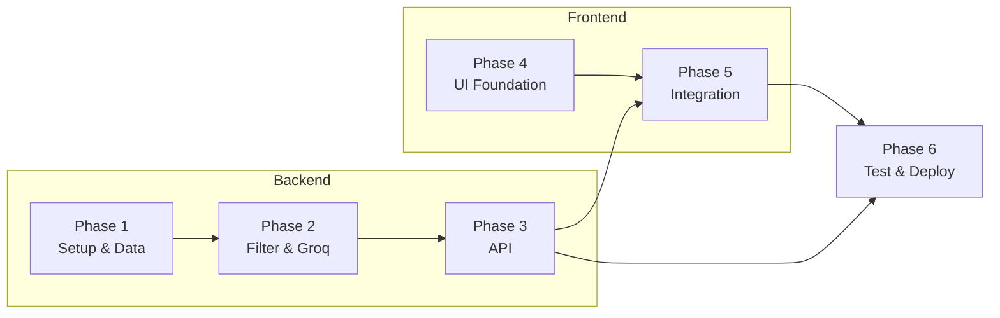

# Zomato AI Restaurant Recommendation System — Implementation Plan

> Derived from: [`context.md`](context.md) · [`architecture.md`](architecture.md)  
> LLM: **Groq** · Dataset: [ManikaSaini/zomato-restaurant-recommendation](https://huggingface.co/datasets/ManikaSaini/zomato-restaurant-recommendation)

---

## 1. Plan Overview

This document breaks the project into **Backend and Frontend tracks**, structured across **6 distinct phases**. This ensures a clear separation of concerns, culminating in a highly robust API and a premium, high-quality modern web frontend.

### End-to-End Flow (Target State)

```
[Backend] Setup & Data → Filter & Groq AI → Expose REST API
                                                    ↓
[Frontend] Design System & Foundation → App Integration & Polish
                                                    ↓
[Ops] Test, Harden & Deploy
```

### Phase Summary

**Track 1: Backend Phases**
| Phase | Name | Primary Output | Est. Duration |
|---|---|---|---|
| 1 | Backend Setup & Data Ingestion | FastAPI repo, env config, queryable dataset | 1–2 days |
| 2 | Filter Engine & Groq Integration | Deterministic filtering + AI ranking logic | 2–3 days |
| 3 | API & Orchestrator | `POST /recommend` end-to-end (headless) | 1–2 days |

**Track 2: Frontend Phases (Premium Desktop-First UI)**
| Phase | Name | Primary Output | Est. Duration |
|---|---|---|---|
| 4 | Frontend Foundation & Design System | Modern web framework setup, core UI tokens | 1–2 days |
| 5 | Application & API Integration | Dynamic, highly-polished web interface | 2–3 days |

**Track 3: Finalization**
| Phase | Name | Primary Output | Est. Duration |
|---|---|---|---|
| 6 | Testing, Hardening & Deployment | Tests, fallbacks, Docker, docs | 2–3 days |

**Total estimated effort:** 9–15 days (solo developer, MVP scope)

---

## 2. Phase Dependency Map



---

## Track 1: Backend Phases

### Phase 1 — Backend Setup & Data Ingestion

**Objective:** Establish the backend foundation, load the Zomato dataset, clean it, and cache a normalized version for fast reuse.

**Tasks:**
- [ ] Initialize Python project (`Python 3.11+`) with `fastapi`, `uvicorn`, `pandas`, `datasets`, `openai`.
- [ ] Implement `app/config.py` for centralized environment variable management.
- [ ] Implement `app/data/loader.py` to fetch from Hugging Face and cache locally as Parquet.
- [ ] Implement `app/data/preprocessor.py` to normalize ratings, prices, and cuisines.
- [ ] Wire dataset load into app startup (lifespan event in FastAPI).

**Acceptance Criteria:**
- Cold load completes in < 30s; warm load in < 2s.
- FastAPI starts successfully with a `GET /health` endpoint verifying dataset status.

### Phase 2 — Filter Engine & Groq Integration

**Objective:** Implement deterministic candidate retrieval and connect it to Groq for ranking and explanations.

**Tasks:**
- [ ] Define Pydantic models: `UserPreferences`, `Restaurant`, `Recommendation`.
- [ ] Implement `app/data/filter.py` to filter by location, budget, cuisine, and rating. Returns top K candidates.
- [ ] Implement `app/llm/groq_client.py` using Groq API (e.g., `llama-3.3-70b-versatile`).
- [ ] Implement `app/llm/prompt_builder.py` to safely serialize candidate data into the prompt.
- [ ] Implement `app/llm/parser.py` to validate JSON response and merge with dataset fields. Ensure fallback logic if LLM fails.

**Acceptance Criteria:**
- Filter engine reliably narrows down candidates in < 100ms.
- Groq returns structured JSON ranking with explanations.
- Hallucinations are rejected and rule-based fallback works.

### Phase 3 — API & Orchestrator

**Objective:** Wire the filter and Groq layers into a REST API.

**Tasks:**
- [ ] Implement `app/services/recommender.py` to orchestrate Filter → LLM workflow.
- [ ] Create `app/api/routes.py` exposing `POST /api/v1/recommend`.
- [ ] Create `GET /api/v1/metadata` to provide available locations, cuisines, and budgets for the frontend.
- [ ] Add strict input validation and appropriate HTTP error codes.

**Acceptance Criteria:**
- `POST /api/v1/recommend` returns end-to-end results under 6s.
- Metadata endpoint correctly powers frontend dropdown options.

---

## Track 2: Frontend Phases (Premium Desktop-First UI)

### Phase 4 — Frontend Foundation & Design System

**Objective:** Establish a modern, high-quality web application structure optimized explicitly for desktop-first experiences, avoiding basic Streamlit implementations.

**Tasks:**
- [ ] Initialize a modern framework (e.g., Vite + React, or Next.js).
- [ ] Set up a robust styling system focusing on rich aesthetics, vibrant colors, glassmorphism, and sleek dark mode capabilities tailored for large screens.
- [ ] Define foundational design tokens (typography, colors, spacing, shadows) that take advantage of desktop real estate.
- [ ] Build reusable UI components (Buttons, Inputs, Selects, Cards) with subtle micro-animations and hover effects optimized for mouse interactions.
- [ ] Apply SEO best practices natively on pages.

**Acceptance Criteria:**
- Framework runs locally (`npm run dev`) with zero errors.
- Design system components look extremely premium, dynamic, and prioritize desktop-first layouts.

### Phase 5 — Application & API Integration

**Objective:** Build the user-facing forms and results dashboards, connecting them directly to the backend API.

**Tasks:**
- [ ] Build the Preference Input Form utilizing the metadata endpoint for dropdowns.
- [ ] Implement loading states with beautiful skeleton loaders or custom animations during the ~6s backend wait time.
- [ ] Build the Recommendations Results View showcasing stunning cards or a multi-column grid for each restaurant (name, rating, cost, and the Groq-generated explanation) to maximize desktop viewing.
- [ ] Add smooth transitions between the form state and the results state.
- [ ] Implement graceful error banners if the API fails or returns no results.

**Acceptance Criteria:**
- User can input preferences, view loading states, and receive ranked results smoothly.
- The UI must "wow" the user and feel state-of-the-art.

---

## Track 3: Finalization

### Phase 6 — Testing, Hardening & Deployment

**Objective:** Validate quality, add resilience, and prepare the project for demo or production use.

**Tasks:**
- [ ] Write backend unit tests (preprocessor, filter, prompt builder, parser).
- [ ] Perform Groq evaluation on 5–10 sample queries to manually verify grounding.
- [ ] Log Groq latency and token usage.
- [ ] Containerize the application: Create a `Dockerfile` for the backend and a separate configuration for frontend hosting.
- [ ] Finalize `README.md` with clear setup, run, and demo instructions.

**Acceptance Criteria:**
- All automated tests pass.
- App and UI can be launched easily via documented instructions.
- Secrets are properly managed via `.env`.

---

## 3. Milestone Checklist

| Requirement | Phase | Status |
|---|---|---|
| Load dataset & preprocess | 1 | ☐ |
| Filter data based on user input | 2 | ☐ |
| Groq ranks and explains choices | 2 | ☐ |
| Expose backend over REST API | 3 | ☐ |
| Build high-quality modern frontend | 4 & 5 | ☐ |
| Display rich recommendations in UI | 5 | ☐ |
| Testing and Dockerization | 6 | ☐ |

---

## 4. Risk Register & Mitigations

| Risk | Impact | Mitigation | Phase |
|---|---|---|---|
| Groq API latency or rate limits | Slow/failed responses | Rule-based fallback, robust UI loading states | 2, 5 |
| UI feels generic | Fails premium requirement | Prioritize micro-animations, color palettes, and glassmorphism | 4, 5 |
| Dataset parsing errors | Backend crashes | Strict pandas normalization and Pydantic validation | 1 |
| Prompt token overflow | Groq 400 errors | Cap candidates at 30, exclude raw review lists | 2 |

---

## 5. Recommended Build Order

| Day | Focus | Exit Criteria |
|---|---|---|
| 1–2 | Phase 1 & 2 | Filter returns candidates; Groq ranks them |
| 3 | Phase 3 | `POST /recommend` works via API clients |
| 4 | Phase 4 | Frontend scaffolding and design system complete |
| 5–6 | Phase 5 | Frontend integrated with API, visually polished |
| 7–8 | Phase 6 | Tests pass, Docker runs, README complete |

---

## 6. Out of Scope (MVP)

- Semantic / embedding-based search
- User history and personalization
- Redis caching for multi-instance deployment
- Review summarization from raw dataset `reviews_list`

---

## 7. Definition of Done

The project is **complete** when:
1. A user enters preferences into a premium, animated frontend.
2. The backend filters ~51K restaurants and uses Groq to rank and explain top picks.
3. The UI presents the results in a stunning layout.
4. Fallbacks, loading states, and errors are handled gracefully.
5. The entire stack is documented and deployable.
